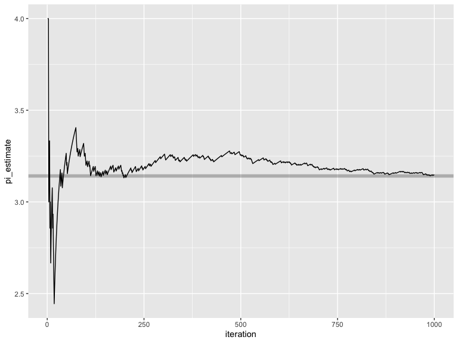
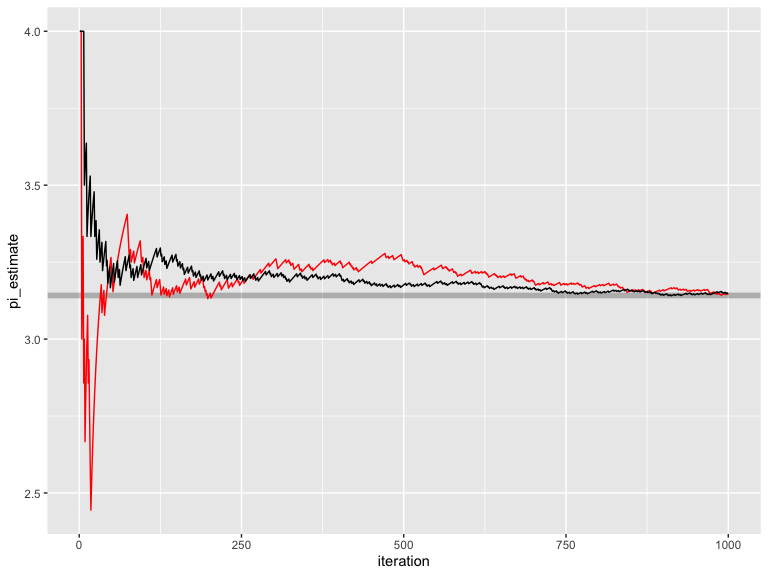
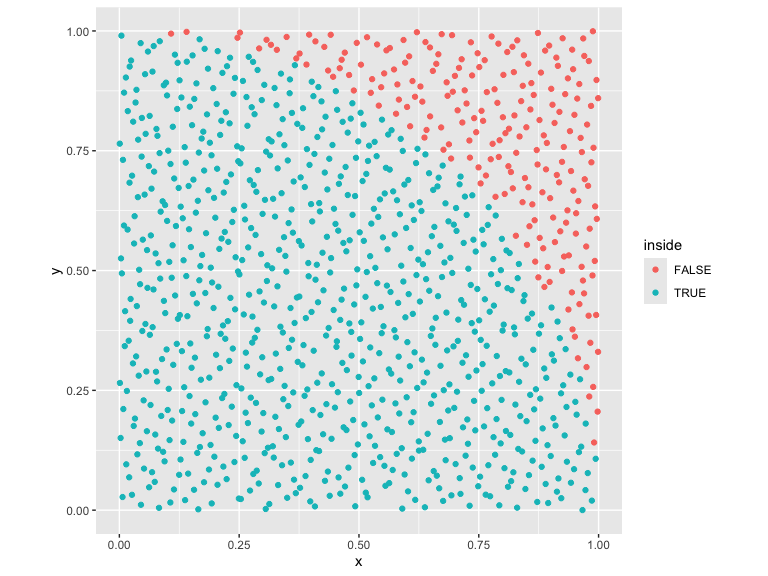
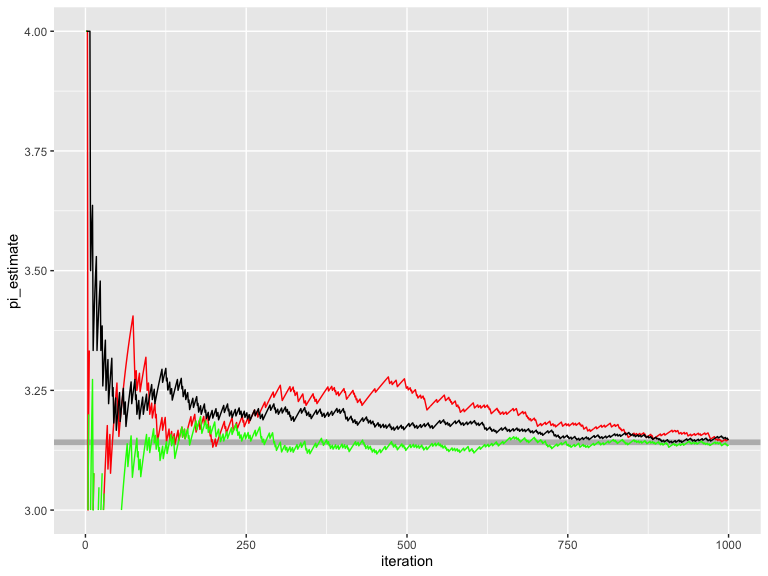
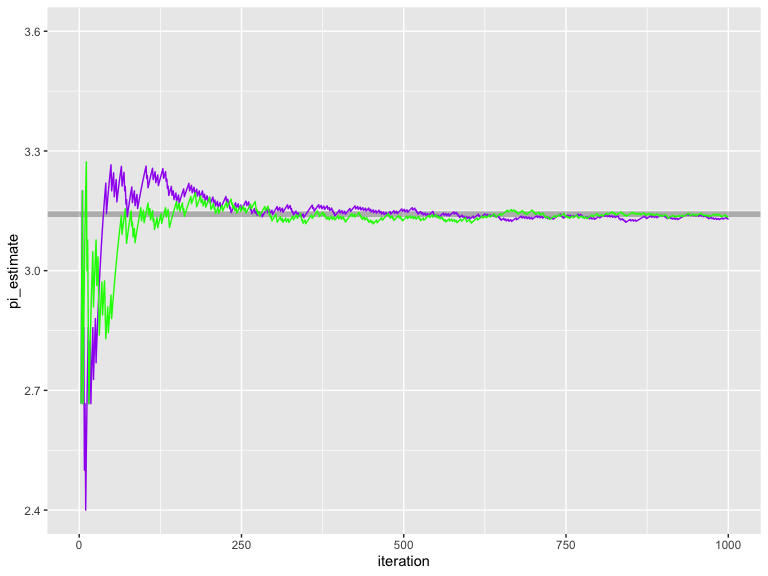
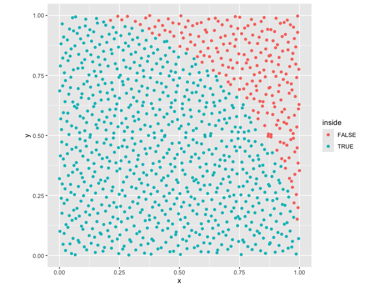

<!-- README.md is generated from README.Rmd. Please edit that file -->

# spacefillr

<!-- badges: start -->

[](https://github.com/tylermorganwall/spacefillr/actions)
[](https://github.com/tylermorganwall/spacefillr/actions)
<!-- badges: end -->

spacefillr is a package for generating random and quasi-random
space-filling sequences. Supports the following sequences: ‘Halton’,
‘Sobol’, ‘Owen’-scrambled ‘Sobol’, progressive jittered, progressive
multi-jittered (‘PMJ’), ‘PMJ’ with blue noise, ‘PMJ02’, and ‘PMJ02’ with
blue noise. Includes a ‘C++’ ‘API’. Methods derived from “Constructing
Sobol sequences with better two-dimensional projections” (2012) S. Joe
and F. Y. Kuo, and “Progressive Multi‐Jittered Sample Sequences” (2018)
Christensen, P., Kensler, A. and Kilpatrick, C.

## Installation

You can install the released version of spacefillr from Github with the
following:

``` r
remotes::install_github("tylermorganwall/spacefillr")
```

## Example

Generating random sequences is an important topic when trying to solve
problems using Monte Carlo methods. Careful choice of the correct random
(or quasi-random) sequence can result in much faster convergence to the
final answer. Let’s take the problem of solving for the value of Pi by
counting the number of values that fall within the unit circle. If we
generate random values between 0 and 1, count how many fall within the
unit circle, multiply by 4 and divide by the number of samples, we will
get an estimate for Pi.

Let’s first try this with purely uniform random numbers:

``` r
library(ggplot2)
library(dplyr)
set.seed(1)
results_rand = as.data.frame(matrix(runif(2000),ncol=2))
colnames(results_rand) = c("x","y")

results_rand %>% 
  mutate(inside = x^2 + y^2 < 1) %>% 
  ggplot() + 
  geom_point(aes(x=x,y=y,color=inside)) +
  coord_fixed()
```


We can plot the convergence:

``` r
results_rand_convergence = results_rand %>% 
  mutate(inside = x^2 + y^2 < 1, iteration = 1:n()) %>% 
  mutate(pi_estimate = 4*cumsum(inside)/iteration) 

ggplot(results_rand_convergence) +
  geom_hline(yintercept = pi, alpha=0.25,color="black",size=2) +
  geom_line(aes(x=iteration,y=pi_estimate))
```



Uniform random numbers, however, have poor convergence properties. We
can do better by using spacefillr to generate sequences that are more
evenly distributed throughout space, which helps these Monte Carlo
integrals converge more quickly.

We’ll first start with a Halton sequence:

``` r
library(spacefillr)

results_halton = as.data.frame(generate_halton_random_set(1000,2,seed=1))
colnames(results_halton) = c("x","y")

results_halton %>% 
  mutate(inside = x^2 + y^2 < 1) %>% 
  ggplot() + 
  geom_point(aes(x=x,y=y,color=inside)) +
  coord_fixed()
```


These samples are much more evenly distributed. Let’s compare the
convergence of this sequence to random uniform numbers:

``` r
results_halton_convergence = results_halton %>% 
  mutate(inside = x^2 + y^2 < 1, iteration = 1:n()) %>% 
  mutate(pi_estimate = 4*cumsum(inside)/iteration) 

ggplot() +
  geom_hline(yintercept = pi, alpha=0.25,color="black",size=2) +
  geom_line(data=results_rand_convergence,aes(x=iteration,y=pi_estimate), color="red") +
  geom_line(data=results_halton_convergence,aes(x=iteration,y=pi_estimate), color="black")
```



We can see this set of quasi-random numbers converges significantly
faster than random uniform. Let’s now use the gold-standard quasi-random
sequence: Owen-scrambled Sobol. (note: another function
`generate_sobol_owen_fast_set()` is also included in the package that
outputs near-ideal Owen scrambled Sobol numbers, but is much faster).

``` r
results_owen_sobol = as.data.frame(generate_sobol_owen_set(1000,2,seed=1))
colnames(results_owen_sobol) = c("x","y")

results_owen_sobol %>% 
  mutate(inside = x^2 + y^2 < 1) %>% 
  ggplot() + 
  geom_point(aes(x=x,y=y,color=inside)) +
  coord_fixed()
```



Let’s look at the convergence properties of this set.

``` r
results_owen_sobol_convergence = results_owen_sobol %>% 
  mutate(inside = x^2 + y^2 < 1, iteration = 1:n()) %>% 
  mutate(pi_estimate = 4*cumsum(inside)/iteration) 

ggplot() +
  geom_hline(yintercept = pi, alpha=0.25,color="black",size=2) +
  geom_line(data=results_rand_convergence,aes(x=iteration,y=pi_estimate), color="red") +
  geom_line(data=results_halton_convergence,aes(x=iteration,y=pi_estimate), color="black") + 
  geom_line(data=results_owen_sobol_convergence,aes(x=iteration,y=pi_estimate), color="green") +
  scale_y_continuous(limits=c(3,4))
#> Warning: Removed 3 row(s) containing missing values (geom_path).
```



Owen-scrambled Sobol converges the fastest out of all of the sequences.
Also included are the progressive multijittered sequences, of which
pmj02 has similar convergence properties to Owen-scrambled Sobol.

``` r
results_owen_pmj02 = as.data.frame(generate_pmj02_set(1000,seed=1))
colnames(results_owen_pmj02) = c("x","y")

results_owen_pmj02 %>% 
  mutate(inside = x^2 + y^2 < 1) %>% 
  ggplot() + 
  geom_point(aes(x=x,y=y,color=inside)) +
  coord_fixed()
```


We can compare this to Owen-scrambled Sobol:

``` r
results_owen_pmj02_convergence = results_owen_pmj02 %>% 
  mutate(inside = x^2 + y^2 < 1, iteration = 1:n()) %>% 
  mutate(pi_estimate = 4*cumsum(inside)/iteration) 

ggplot() +
  geom_hline(yintercept = pi, alpha=0.25,color="black",size=2) +
  geom_line(data=results_owen_pmj02_convergence,aes(x=iteration,y=pi_estimate), color="purple") +
  geom_line(data=results_owen_sobol_convergence,aes(x=iteration,y=pi_estimate), color="green") +
  scale_y_continuous(limits=c(2.4,3.6))
#> Warning: Removed 2 row(s) containing missing values (geom_path).

#> Warning: Removed 2 row(s) containing missing values (geom_path).
```



An interesting properties of pmj02 sequences (absent from Sobol
sequences) is that they can be generated with blue noise properties.

``` r
results_owen_pmj02bn = as.data.frame(generate_pmj02bn_set(1000,seed=1))
colnames(results_owen_pmj02bn) = c("x","y")

results_owen_pmj02bn %>% 
  mutate(inside = x^2 + y^2 < 1) %>% 
  ggplot() + 
  geom_point(aes(x=x,y=y,color=inside)) +
  coord_fixed()
```



This does not help convergence, but has some applications in some types
of Monte Carlo problems.

## C++ API

This package also includes a C++ API for accessing Halton and Sobol
sequences, which allows you to generate these sequences quickly in your
C++ code. You can access a halton sequence by creating a Halton object:

``` c
#include "halton_sampler.h"

spacefillr::Halton_sampler hs;
hs.init_faure();
//This generates the 10th value of the 2nd dimension of the Halton sequence
double val = hs.sample(10,2);
//This generates a 3D point in space
double val[3] = {hs.sample(1,1), hs.sample(1,2), hs.sample(1,3)};
```

To access Sobol values, call the following functions (no object is
needed):

``` c
#include "sobol.h"

//Sobol, no Owen-scrambling: 1st value, 10th dimension
double val1 = spacefillr::sobol_single(1, 10)

//Slow (but highest quality) generator: 1st value, 10th dimension,  setting the random seed for that sequence to 1234
double val2 = spacefillr::sobol_owen_reference_single(1, 10, 1234)

//Fast generator: 1st value, 10th dimension,  setting the random seed for that sequence to 1234
double val3 = spacefillr::sobol_owen_fast_single(1, 10, 1234)

//This generates a 3D point in space
double val[3] = {spacefillr::sobol_owen_fast_single(1,1, 10),
                 spacefillr::sobol_owen_fast_single(1,2, 10), 
                 spacefillr::sobol_owen_fast_single(1,3, 10)};
```
